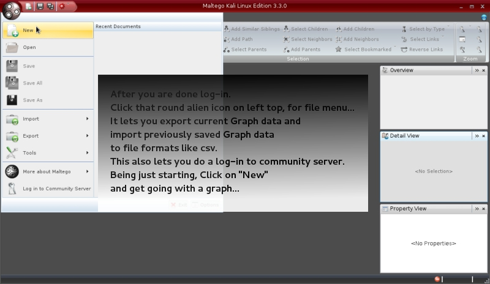

##### Quick Tryout ScreenShots

* Step.1 Create a new Graph

...

* Step.2 Either RightClick on Graph and Run Machine

...

* Step.3 Or Drag and Drop an Item from Palette on Graph and give desired value

...

* Step.4 Right Click on the Item and select desired Transform to run

...

* Step.5 Now switching to Bubble View will show dynamic updates from Transform run

...

* Step.6 Once Transform completes switch to Entity List view for tabular look of all information.

...

* Step.7 Now you can Switch to Main View, change node structure for better view, import/export/save the Graph and more

...

***
